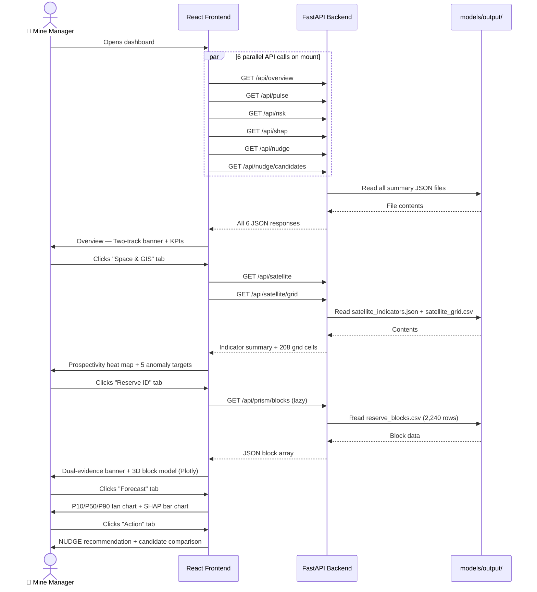

# OreSight — Architecture Diagrams

**Hackathon:** Smart India Hackathon 2026 — SIH26009

> Diagrams render in VS Code (`Ctrl+Shift+V` with "Markdown Preview Mermaid Support" extension), GitHub, and Notion.
> Or paste any block at [mermaid.live](https://mermaid.live) to view and export as PNG/SVG.

---

## 1. Two-Track System Architecture

```mermaid
flowchart TD
    subgraph GEO["📁 GEOLOGICAL DATA"]
        D1[boreholes.csv\nMn / Fe / SiO₂ grades]
        D2[blocks.csv\n3D block centroids]
    end

    subgraph SAT["🛰 SATELLITE / REMOTE SENSING DATA"]
        D3[Surface indicators\nNDVI · Iron Oxide · Clay · Moisture]
        D4[Spatial grid\n50 m resolution · 208 cells]
        D5["Integration-ready:\nSentinel-2 · ISRO Bhuvan · Landsat"]
    end

    subgraph OPS["⚙ OPERATIONAL DATA"]
        D6[production.csv]
        D7[equipment.csv]
        D8[blast.csv]
        D9[development.csv]
        D10[manpower.csv]
        D11[weather.csv]
    end

    subgraph TRACK1["🔷 TRACK 1 — Reserve Identification\nSpace + Geology"]
        RS["🛰 REMOTE SENSING\nSurface indicator generation\nProspectivity scoring\n5 anomaly targets"]
        PRISM["⛏ PRISM\nOrdinary Kriging\n48.27 Mt declared reserve\n498 ore blocks"]
        INT["⊕ Integrated Reserve\nIdentification\nSurface + subsurface\nevidence combined"]
    end

    subgraph BRIDGE["🔶 BRIDGE — Accessibility"]
        EAR["EAR\nOperational constraints\n32.74 Mt accessible\n67.8% ratio"]
    end

    subgraph TRACK2["🟢 TRACK 2 — Production Intelligence\nOperations + AI/ML"]
        PULSE["📈 PULSE\nLightGBM Quantile Regression\nP10 / P50 / P90\n88.4% shortfall prob"]
        RISK["🔴 RISK + SHAP\nCRITICAL risk\nTreeExplainer attribution\nACTIONABLE vs CONTEXTUAL"]
        NUDGE["⭐ NUDGE\nPuLP counterfactual\ndevelopment_m +606.6 t"]
    end

    subgraph API["🚀 FASTAPI BACKEND — v0.2.0\nhttp://127.0.0.1:8000"]
        B1["/api/satellite\n/api/satellite/grid"]
        B2["/api/prism\n/api/prism/blocks"]
        B3["/api/ear\n/api/ear/blocks"]
        B4["/api/pulse\n/api/risk\n/api/shap"]
        B5["/api/nudge\n/api/nudge/candidates"]
    end

    subgraph UI["🖥 REACT DASHBOARD\nhttp://localhost:5173"]
        F1["Overview\nTwo-track banner + KPIs"]
        F2["Space & GIS\nHeat map + targets"]
        F3["Reserve ID\nDual-evidence + 3D model"]
        F4["Accessibility\n3D scatter + funnel"]
        F5["Forecast\nFan chart + SHAP"]
        F6["Action\nNUDGE recommendation"]
    end

    D1 & D2 --> PRISM
    D3 & D4 --> RS
    D6 & D7 & D8 & D9 & D10 & D11 --> EAR
    D6 & D7 & D8 & D9 & D10 & D11 --> PULSE

    RS --> INT
    PRISM --> INT
    INT --> EAR
    EAR --> PULSE
    PULSE --> RISK
    RISK --> NUDGE

    RS --> B1
    PRISM --> B2
    EAR --> B3
    PULSE & RISK --> B4
    NUDGE --> B5

    B1 --> F2
    B2 --> F3
    B3 --> F4
    B4 --> F5
    B5 --> F6
    B1 & B2 & B3 & B4 & B5 --> F1

    style TRACK1 fill:#1a1f3a,stroke:#58a6ff
    style TRACK2 fill:#1a2f1a,stroke:#3fb950
    style BRIDGE fill:#2a1a0a,stroke:#f0883e
    style SAT fill:#1a1a2a,stroke:#bc8cff
```

---

## 2. Track 1 — Reserve Identification Detail

```mermaid
flowchart LR
    subgraph SAT_PROC["🛰 Satellite Processing"]
        S1[Spatial grid\n50 m resolution]
        S2[IDW grade proxy\nfrom boreholes]
        S3[Spectral indices\nNDVI · IOI · CAI · NDWI]
        S4[Composite\nProspectivity Score]
        S5[Top-5 surface\nanomaly targets]
        S1 --> S2 --> S3 --> S4 --> S5
    end

    subgraph GEO_PROC["⛏ Geological Processing — PRISM"]
        G1[Borehole composites\nsparse Mn grades]
        G2[Spherical variogram\ngrid-search fit]
        G3[Ordinary Kriging\n20 nearest neighbours\nZ-anisotropy ×5]
        G4[Ore classification\nMn ≥ 20% cutoff]
        G5["48.27 Mt declared\n498 ore blocks"]
        G1 --> G2 --> G3 --> G4 --> G5
    end

    INT["⊕ Integrated Reserve\nIdentification\n\nSurface anomalies ↔ Subsurface grades\nSpatial co-location analysis"]

    SAT_PROC --> INT
    GEO_PROC --> INT

    NOTE["⚠ DISCLAIMER\nSatellite → surface context only\nSubsurface → boreholes + kriging\nNeither alone is sufficient"]

    INT --> NOTE

    style SAT_PROC fill:#1a1a2a,stroke:#bc8cff
    style GEO_PROC fill:#0d1f0d,stroke:#3fb950
    style INT fill:#1a1a0a,stroke:#f0883e
    style NOTE fill:#2a1a1a,stroke:#f85149
```

---

## 3. Track 2 — Production Intelligence Detail

```mermaid
flowchart LR
    subgraph FEAT["Feature Engineering"]
        F1[38 features\nLag 1/2/3/7/14/30d\nRolling stats 7/14/30d\nEquipment · Blast\nWeather · Calendar]
    end

    subgraph MODELS["LightGBM Quantile Models"]
        M1[α=0.10\nP10 pessimistic]
        M2[α=0.50\nP50 expected]
        M3[α=0.90\nP90 optimistic]
    end

    subgraph RISK_SHAP["RISK + SHAP"]
        R1[Shortfall prob\n88.4%]
        R2[CRITICAL\nrisk level]
        R3[TreeExplainer\non P50 model]
        R4[38 features ranked\nACTIONABLE/CONTEXTUAL]
    end

    subgraph NUDGE_OPT["NUDGE Optimization"]
        N1[4 levers ×\n5 candidate values]
        N2[Counterfactual scoring\nvia P50 model]
        N3[EAR constraint\ncheck]
        N4[PuLP CBC\nbinary selection]
        N5["Best: development_m\n18.53→19.24 m/day\n+606.6 t"]
    end

    EAR_IN[Accessible reserve\n32.74 Mt] --> FEAT
    FEAT --> M1 & M2 & M3
    M1 & M2 & M3 --> R1
    R1 --> R2
    M2 --> R3
    R3 --> R4
    R4 --> N1
    N1 --> N2 --> N3 --> N4 --> N5

    style FEAT fill:#0d1117,stroke:#6e7681
    style MODELS fill:#0d1f0d,stroke:#3fb950
    style RISK_SHAP fill:#1f0d0d,stroke:#f85149
    style NUDGE_OPT fill:#0d1117,stroke:#f0883e
```

---

## 4. Data Flow Sequence

---

## 5. Frontend Component Tree

```mermaid
flowchart TD
    MAIN[main.jsx] --> APP[App.jsx]
    APP --> DASH[Dashboard.jsx\nState: loading/error/data/stage]

    DASH --> HDR[Header.jsx]
    DASH --> STRIP[PipelineStrip.jsx\n6 tabs]
    DASH --> LOAD[LoadingSpinner.jsx]
    DASH --> ERR[ErrorBanner.jsx]

    DASH --> OV[OverviewPanel.jsx\nTwo-track banner\n5-stage flow]
    DASH --> SAT[SatelliteView.jsx\nHeat map · Targets\nLayer stats · Integration info]
    DASH --> PR[PrismView.jsx\nDual-evidence banner\n3D block model]
    DASH --> EA[EarView.jsx\n3D accessibility]
    DASH --> PU[PulseView.jsx\nForecast + SHAP]
    DASH --> NU[NudgeView.jsx\nRecommendation]

    PU --> FC[ForecastChart.jsx]
    PU --> SC[ShapChart.jsx]
    NU --> CT[CandidateTable.jsx]
    PR & EA --> PLOTLY[Plotly 3D — lazy import]

    API[services/api.js\n12 fetch functions] -.->|feeds| DASH

    style SAT fill:#1a1a2a,stroke:#bc8cff
    style PR fill:#0d1f2a,stroke:#58a6ff
```

---

## 6. Key Numbers Flow

```mermaid
flowchart LR
    A["🛰 SPACE\n208 grid cells\n5 anomaly targets\nMean prosp: 0.446"]
    B["⛏ RESERVE\n48.27 Mt declared\n498 ore blocks\nAvg Mn 25.2%"]
    C["🔶 ACCESS\n32.74 Mt accessible\n67.8% ratio\n339/498 blocks"]
    D["📈 FORECAST\nP50: 68,593 t\nPlanned: 71,989 t\nShortfall: 3,396 t"]
    E["🔴 RISK\nProb: 88.4%\nCRITICAL\nfleet · dev · blast"]
    F["⭐ ACTION\ndev_m +0.71 m/day\n+606.6 t gain\nNew prob: 88.0%"]

    A -->|"surface context\nfor reserve ID"| B
    B -->|"declared → accessible\nEAR constraints"| C
    C -->|"caps forecast\nceiling"| D
    D -->|"shortfall prob\nfeeds"| E
    E -->|"actionable drivers\nfeed"| F

    style A fill:#1a1a2a,color:#bc8cff,stroke:#bc8cff
    style B fill:#1e3a5f,color:#58a6ff,stroke:#58a6ff
    style C fill:#1a2a0a,color:#3fb950,stroke:#3fb950
    style D fill:#0d1117,color:#e6edf3,stroke:#58a6ff
    style E fill:#3a0d0d,color:#f85149,stroke:#f85149
    style F fill:#1a1a0a,color:#f0883e,stroke:#f0883e
```

---

## How to View

| Tool | How |
|---|---|
| **VS Code / Kiro** | Install [Markdown Preview Mermaid Support](https://marketplace.visualstudio.com/items?itemName=bierner.markdown-mermaid) → `Ctrl+Shift+V` |
| **GitHub** | Push to repo — renders natively in `.md` files |
| **Mermaid Live Editor** | Paste any diagram block at [mermaid.live](https://mermaid.live) → export PNG/SVG |
| **Notion** | `/code` block → set language to `mermaid` |
